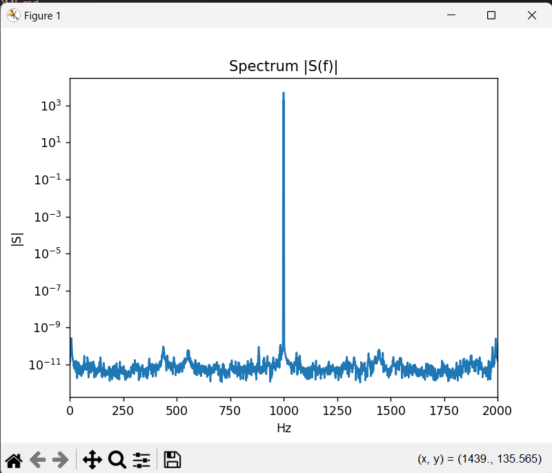

# RF-to-Bits (AM Radio Simulation)

This project is a simple Python simulation of how analog RF signals carry information.  
It demonstrates how a baseband message can be **modulated onto a carrier, transmitted through a noisy channel, and then demodulated and filtered** to recover the original signal.  
I made this project to help me with my research and effectively learn how physical components such as oscilators relate to Python code.
---


## Signal Model

1. **Message signal (baseband)**

$$
m(t) = \sin(2\pi f_m t)
$$

2. **Carrier signal (oscillator)**

$$
c(t) = \cos(2\pi f_c t)
$$

3. **Amplitude modulation (AM)**

$$
s(t) = \bigl(1 + \mu\, m(t)\bigr)\cos(2\pi f_c t)
$$

- $f_c$: carrier frequency  
- $f_m$: message frequency  
- $\mu$: modulation index (strength of modulation)

4. **Channel with noise**

$$
r(t) = s(t) + n(t)
$$

Where $n(t)$ is additive white Gaussian noise (AWGN).

5. **Envelope detection (demodulation)**

$$
\hat{m}(t) \approx \bigl|\,\mathrm{Hilbert}[\,r(t)\,]\,\bigr|
$$

6. **Low-pass filtering**

$$
m_{\text{hat}}(t) = \mathrm{LPF}\!\bigl(\hat{m}(t)\bigr)
$$


---

## Steps in the Simulation
1. **Message signal (m):** Generate a sine wave.  
2. **Carrier (c):** Generate a higher-frequency oscillator tone.  
3. **Amplitude modulation (s):** Multiply the carrier by $(1 + \mu m)$.  
4. **Channel:** Add white Gaussian noise.  
5. **Demodulation:** Use an envelope detector (Hilbert transform).  
6. **Filtering:** Apply a low-pass filter to recover the message.  

---

## Spectrum Example
  

*Figure 1: Spectrum of the AM signal. The tall peak at $f_c = 1000 \,\text{Hz}$ is the carrier, and the smaller sidebands at $f_c \pm f_m$ represent the message. Noise is visible at lower levels across the band.*

---

## Requirements
- Python 3
- NumPy
- SciPy
- Matplotlib

Install dependencies:
```bash
pip install numpy scipy matplotlib
